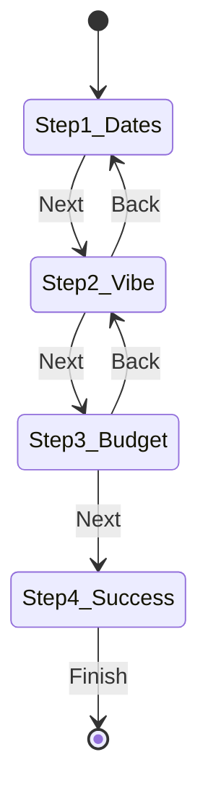

# Application Overview: I Love Medellín

## 1. Technical Stack & Versions

The application utilizes a modern, browser-native ES Module architecture with React 19.

| Component | Technology | Version | Source |
| :--- | :--- | :--- | :--- |
| **Core Framework** | React | `^19.2.3` | `esm.sh` (Importmap) |
| **DOM Rendering** | React DOM | `^19.2.3` | `esm.sh` (Importmap) |
| **Routing** | React Router DOM | `^7.12.0` | `esm.sh` (Importmap) |
| **Styling** | Tailwind CSS | `v3.x` | CDN (Script Injection) |
| **Icons** | Lucide React | `^0.562.0` | `esm.sh` (Importmap) |
| **Build Tooling** | Vite (Implied) | - | Native ES Modules |

---

## 2. Directory Structure

The project follows a flat, feature-based organization within the source root.

```text
/
├── index.html                  # Entry point (Importmaps, Tailwind Config)
├── index.tsx                   # React Root Mount
├── App.tsx                     # Main Router Configuration
├── metadata.json               # App Metadata & Permissions
├── types.ts                    # Global TypeScript Interfaces
├── docs/
│   └── 01-overview.md          # This documentation
├── components/
│   ├── Layout.tsx              # App Shell (Sidebar + Content + Mobile Header)
│   ├── Sidebar.tsx             # Navigation Logic
│   ├── PlaceCard.tsx           # UI Component for listings
│   └── TripWizard.tsx          # 4-Step Modal Workflow
└── pages/
    ├── Explore.tsx             # Main Dashboard (3-Panel Layout)
    ├── Concierge.tsx           # AI Chat Interface
    ├── DashboardPlaceholder.tsx # Generic Empty State Page
    └── Marketing.tsx           # Public Landing Pages
```

---

## 3. Architecture & Routing

### Router Setup
The application uses `HashRouter` to ensure compatibility with static hosting environments where server-side routing configuration might be limited.

### Sitemap & Import Paths

| Path | Component | Type | Description |
| :--- | :--- | :--- | :--- |
| **/** | `Marketing.tsx` | Public | Home Landing Page |
| **/about** | `Marketing.tsx` | Public | About Page |
| **/features** | `Marketing.tsx` | Public | Features Page |
| **/app** | `Layout.tsx` | Protected* | **App Shell Root** |
| ├── **/explore** | `Explore.tsx` | Dashboard | Main Discovery Feed |
| ├── **/trips** | `DashboardPlaceholder` | Dashboard | User Trips |
| ├── **/events** | `DashboardPlaceholder` | Dashboard | Events List |
| ├── **/restaurants**| `DashboardPlaceholder` | Dashboard | Restaurant Directory |
| ├── **/rentals** | `DashboardPlaceholder` | Dashboard | Stays/Rentals |
| ├── **/saved** | `DashboardPlaceholder` | Dashboard | Saved Items |
| └── **/concierge** | `Concierge.tsx` | Dashboard | AI Chat Interface |

*> *Note: "Protected" refers to the layout context, though actual auth logic is currently mocked.*

---

## 4. UI Layout Logic

### Dashboard (3-Panel Design)
The `Explore` page implements a responsive 3-panel design pattern on large screens:

1.  **Left Panel (Navigation)**:
    *   Managed by `Sidebar.tsx` inside `Layout.tsx`.
    *   Fixed width (`w-64`).
    *   Collapsible on mobile (Drawer).
2.  **Center Panel (Feed/Content)**:
    *   Managed by `Explore.tsx`.
    *   Fluid width (`flex-1`).
    *   Contains Search, Filters, Categories, and Card Grids.
3.  **Right Panel (Context/Map)**:
    *   Managed by `Explore.tsx`.
    *   Visible only on `xl` screens (`hidden xl:block`).
    *   Fixed width (`w-96`).
    *   Displays abstract map visualization.

### Architecture Diagram

```mermaid
graph TD
    HTML[index.html] --> Index[index.tsx]
    Index --> App[App.tsx]
    App --> HashRouter
    
    subgraph Public Routes
        HashRouter --> Home[Marketing (Home)]
        HashRouter --> About[Marketing (About)]
    end

    subgraph App Routes
        HashRouter --> Layout[Layout.tsx]
        Layout --> Sidebar[Sidebar.tsx]
        Layout --> Wizard[TripWizard.tsx]
        Layout --> Outlet[Outlet]
        
        Outlet --> Explore[Explore.tsx]
        Outlet --> Concierge[Concierge.tsx]
        Outlet --> Placeholders[DashboardPlaceholder.tsx]
    end
```

---

## 5. Workflows & Features

### A. Trip Wizard Flow
Located in `components/TripWizard.tsx`, this is a modal-based state machine independent of the URL routing.

**State Flow:**
1.  **Step 1: Dates** - Select date range.
2.  **Step 2: Vibe** - Select tags (Nightlife, Nature, etc.).
3.  **Step 3: Budget** - Select daily budget tier.
4.  **Step 4: Success** - Confirmation screen.



### B. Concierge (AI Chat)
Located in `pages/Concierge.tsx`.
*   **Layout**: Full-height flex column.
*   **Components**:
    *   Message History (Scrollable area).
    *   Input Area (Fixed at bottom).
*   **Current State**: UI Mockup with hardcoded conversation turns.

---

## 6. Frontend/Backend Split

*   **Frontend**: Pure Client-Side Rendering (CSR).
*   **Backend**: Currently simulated.
    *   Data is hardcoded in `Explore.tsx` arrays (`restaurants`, `activities`, `stays`).
    *   User profile is hardcoded in `Layout.tsx`.
    *   Auth state is implicit.
    *   AI responses are static strings in `PlaceCard.tsx` and `Concierge.tsx`.

## 7. Configuration Details

*   **Tailwind**: Configured via the `tailwind.config` object in `index.html`.
    *   Custom Colors: `medellin` (Green palette), `brand` (Orange/Dark).
    *   Font: Inter (Google Fonts).
*   **Icons**: Imported individually from `lucide-react` to optimize ESM loading.
