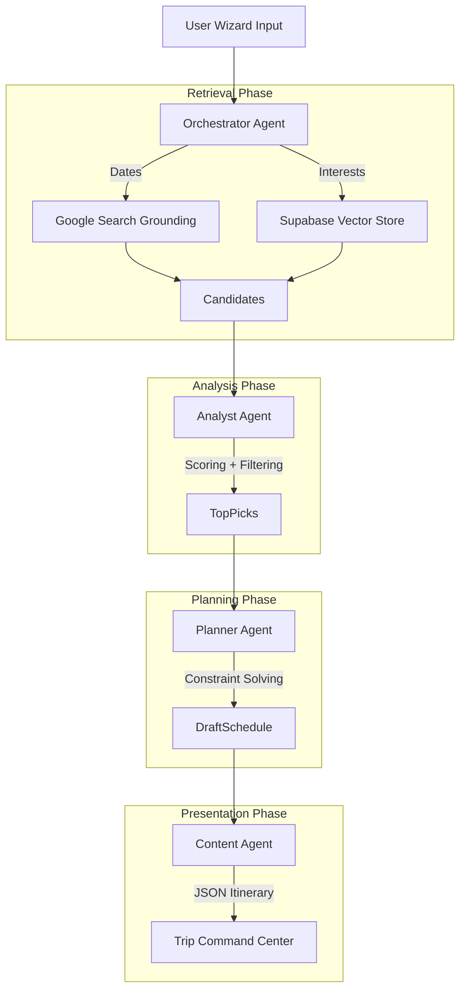

# Mega Plan: AI Trip Planner & Intelligence System
**Product:** I Love Medellín  
**Role:** Senior AI Architect & Product Designer  
**Target:** Production-Ready Architecture

---

## 1. Executive Summary

The **AI Trip Planner** is the engine of the "I Love Medellín" platform. It transforms vague user intent ("I want a fun weekend") into a structured, bookable, and highly personalized itinerary.

We utilize a **Human-in-the-Loop AI Agent System** where Gemini 3 acts as the planner, but the user remains the Controller. The system integrates existing modules (Restaurants, Events, Tourist, Real Estate) into a cohesive timeline using a **3-Panel Command Center**.

---

## 2. Goals & Metrics

| Metric | Target | Description |
| :--- | :--- | :--- |
| **Time-to-Plan** | < 15s | Time from Wizard submission to first draft itinerary. |
| **Interaction Rate** | > 40% | Users who customize (drag/drop/replace) the AI draft. |
| **Explanation Trust** | High | Every suggestion must have a "Why this fits" reason. |
| **Constraint Safety** | 100% | No suggesting closed venues or geographically impossible routes. |

---

## 3. User Experience (UX) Architecture

### A. The Input: Smart Wizard (Modal)
A 5-step flow collecting strictly necessary signals for the AI Agents.

1.  **Dates & Travelers**: Start/End dates, Party size (Solo, Couple, Family, Group).
2.  **Vibe & Interests** (Multi-select):
    *   *Core*: Nightlife, Nature, History, Foodie.
    *   *Niche*: Digital Nomad (Wifi focus), Real Estate (Living scouting), Salsa, Luxury.
3.  **Pace**: Relaxed (1 activity/day), Balanced (2-3), Packed (4+).
4.  **Budget**: Backpacker, Comfort, Luxury (sets price filters for Search Agent).
5.  **Generation**: "Dreaming up your trip..." animation while Agents work.

### B. The Output: Trip Command Center (3-Panel Layout)

*   **Left Panel (Context & Tools)**:
    *   Trip Metadata (Dates, Budget tracker).
    *   "Bucket List" (Saved items not yet scheduled).
    *   Module quick-add buttons (+ Restaurant, + Event).
*   **Center Panel (The Itinerary)**:
    *   **Timeline View**: Vertical list of Day Cards.
    *   **Day Card**: Morning / Afternoon / Evening slots.
    *   **Drag & Drop**: Move items between days.
*   **Right Panel (Intelligence & Details)**:
    *   **Contextual**: Updates based on what is clicked in the Center.
    *   **AI Insight**: "Why this fits your profile."
    *   **Logistics**: Map snippet, Uber estimate, Reservation link.
    *   **Alternatives**: "Swap with..." suggestions if the user dislikes the selection.

---

## 4. AI Agent System Architecture

We employ a **Multi-Agent Orchestration** pattern using **Gemini 3 Pro** (for reasoning) and **Gemini 3 Flash** (for speed/retrieval).

### 🤖 The Agent Squad

#### 1. The Orchestrator (Manager)
*   **Role**: Receives Wizard payload, delegates tasks, and compiles final JSON.
*   **Model**: `gemini-3-pro-preview` (Thinking Model).
*   **Responsibility**: Decides if we need external search (Google Grounding) or internal DB lookup.

#### 2. The Retriever (RAG + Search)
*   **Role**: Fetches candidates.
*   **Tools**:
    *   `db_search`: Vector similarity search on Supabase `places`.
    *   `google_search_grounding`: Finds live events (concerts, festivals) for specific dates.
*   **Model**: `gemini-3-flash-preview` (Low latency).

#### 3. The Analyst (Scorer)
*   **Role**: Scores candidates against User Profile.
*   **Logic**:
    *   *Input*: Place Tags ["Loud", "Party"] vs User ["Quiet", "Work"].
    *   *Output*: Score (0.0 - 1.0) + Reasoning string.

#### 4. The Planner (Scheduler)
*   **Role**: Solves the Time x Distance x OpeningHours constraint puzzle.
*   **Logic**: Groups high-scoring items into geographical clusters to minimize travel time. Ensure "Morning" items are actually open in the morning.

#### 5. The Content Agent (Copywriter)
*   **Role**: Writes the UI text.
*   **Output**: "Start your day with high-altitude coffee at Pergamino. It matches your 'Digital Nomad' vibe and is only 5 mins from your hotel."

### 🔄 Agent Workflow Diagram



---

## 5. Real-World Use Cases & Flows

### Use Case A: The "Digital Nomad Scout" (Real Estate + Work)
*   **User**: "I'm thinking of moving here. I need good wifi cafes, a look at neighborhoods, and social events."
*   **Agent Actions**:
    *   *Retriever*: Pulls `RealEstate` listings (Open Houses) and `Cafes` with tag "Work Friendly".
    *   *Planner*: Schedules "Coworking at WeWork" (AM), "Lunch at Mondongo's", "Walk through Laureles Neighborhood" (PM).
    *   *Analyst*: Flags Poblado as "Expensive/Tourist" and Laureles as "Local/Green".

### Use Case B: The "Weekend Warrior" (Events + Party)
*   **User**: "Here for 2 days. I want Salsa, heavy nightlife, and street food."
*   **Agent Actions**:
    *   *Search Grounding*: Finds "Live Salsa at Eslabón" specifically for Friday night.
    *   *Planner*: Ensures dinner is *before* the party. Schedules "Hangover Brunch" for Saturday late morning.
    *   *Content*: "This salsa bar gets packed by 11 PM, so we scheduled your arrival for 10 PM."

---

## 6. Technical Implementation

### A. Supabase Database Schema

```sql
-- 1. Trips Header
create table trips (
  id uuid primary key default uuid_generate_v4(),
  user_id uuid references auth.users(id),
  title text,
  start_date date,
  end_date date,
  travelers_count int,
  budget_tier text check (budget_tier in ('backpacker', 'comfort', 'luxury')),
  status text default 'draft',
  created_at timestamptz default now()
);

-- 2. Trip Preferences (The Agent Brain Input)
create table trip_preferences (
  trip_id uuid references trips(id) on delete cascade,
  interests text[], -- ['nightlife', 'history']
  pace text, -- 'relaxed', 'packed'
  dietary_restrictions text[],
  neighborhood_focus text[]
);

-- 3. Itinerary Items (The Output)
create table itinerary_items (
  id uuid primary key default uuid_generate_v4(),
  trip_id uuid references trips(id) on delete cascade,
  day_index int, -- 0 = Day 1
  time_slot text, -- 'morning', 'lunch', 'afternoon', 'dinner', 'evening'
  place_id text, -- ID from our Places/Events DB
  custom_title text,
  ai_reasoning text, -- "Chosen because you love jazz..."
  estimated_cost text,
  order_index int
);
```

### B. Edge Function: `generate_itinerary`

**Interface:**
```typescript
interface GenerateRequest {
  tripId: string;
}

interface GenerateResponse {
  success: boolean;
  itinerary: DayPlan[];
}
```

**Gemini System Instruction (Prompt Template):**
```text
You are an expert Travel Planner for Medellín.
Your goal is to create a logical, geographically efficient itinerary based on the user's profile.

CONTEXT:
User Profile: {JSON_PROFILE}
Available Candidates (Top 20 Scored): {JSON_CANDIDATES}

RULES:
1. Respect Opening Hours.
2. Group locations by neighborhood (El Poblado, Laureles, Centro) to minimize traffic.
3. Lunch should be around 12:00-14:00. Dinner around 19:00-21:00.
4. If "Digital Nomad", prioritize cafes with wifi slots in the morning.
5. Provide a "reason" field for every selection explaining why it matches the User Profile.

OUTPUT:
Return ONLY valid JSON matching the ScheduleSchema.
```

---

## 7. Gemini 3 Integration Specifics

### Search Grounding
We will use **Gemini 3 Pro** with `google_search` tool enabled specifically for the **Events** module to fill gaps.
*   *Trigger*: If User selects "Live Music" or "Festivals".
*   *Query*: "Concerts in Medellín between [Start Date] and [End Date]".

### Structured Outputs
We will strictly enforce JSON schema for the output to ensure the Frontend can render the Drag-and-Drop cards without parsing errors.

```typescript
const itinerarySchema = {
  type: Type.ARRAY,
  items: {
    type: Type.OBJECT,
    properties: {
      day: { type: Type.INTEGER },
      items: {
        type: Type.ARRAY,
        items: {
          type: Type.OBJECT,
          properties: {
            place_id: { type: Type.STRING },
            time_slot: { type: Type.STRING },
            ai_reason: { type: Type.STRING }
          }
        }
      }
    }
  }
}
```

---

## 8. Rollout Phases

1.  **Phase 1: The Skeleton** (Current)
    *   UI: Trip Wizard + Empty Trip Dashboard.
    *   DB: Schema creation.

2.  **Phase 2: The Brain**
    *   Edge Function: `generate_itinerary` with static candidates (Mock retrieval).
    *   Gemini Integration: Basic prompt engineering.

3.  **Phase 3: Intelligence**
    *   Connect Vector Search for retrieval.
    *   Enable Google Search Grounding for events.
    *   Implement "Regenerate Day" feature.
