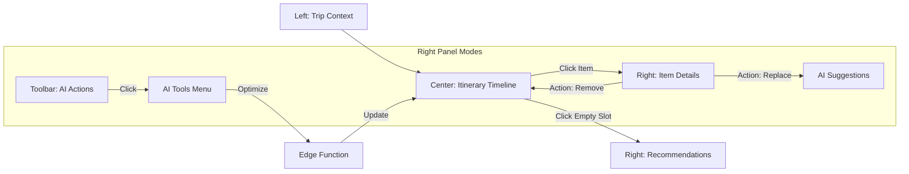
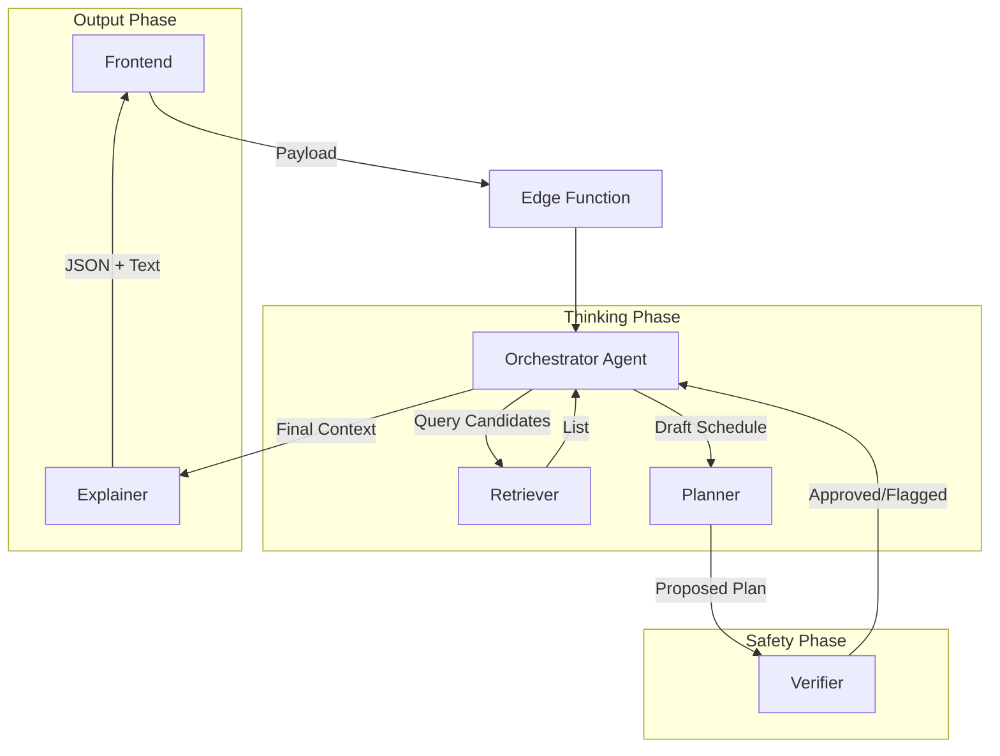
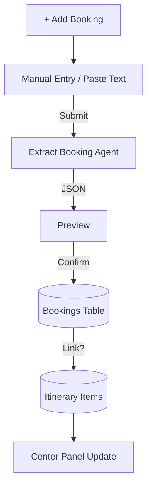

# Mega Plan: AI Trip Planner & Intelligence System
**Product:** I Love Medellín  
**Role:** Senior AI Architect & Product Designer  
**Target:** Production-Ready Architecture

---

## 1. Executive Summary

The **AI Trip Planner** is the engine of the "I Love Medellín" platform. It transforms vague user intent ("I want a fun weekend") into a structured, bookable, and highly personalized itinerary.

We utilize a **Human-in-the-Loop AI Agent System** where Gemini 3 acts as the planner, but the user remains the Controller. The system integrates existing modules (Restaurants, Events, Tourist, Real Estate) into a cohesive timeline using a **3-Panel Command Center**.

**Core Philosophy:** "AI suggests, User confirms."

---

## 2. Goals & Metrics

| Metric | Target | Description |
| :--- | :--- | :--- |
| **Time-to-Plan** | < 15s | Time from Wizard submission to first draft itinerary. |
| **Interaction Rate** | > 40% | Users who customize (drag/drop/replace) the AI draft. |
| **Explanation Trust** | High | Every suggestion must have a "Why this fits" reason. |
| **Constraint Safety** | 100% | No suggesting closed venues or geographically impossible routes. |

---

## 3. Screen Behaviors & UX Architecture

### A. The Input: Smart Wizard (Modal)
A 5-step flow collecting strictly necessary signals for the AI Agents.

1.  **Dates & Travelers**: Start/End dates, Party size (Solo, Couple, Family, Group).
2.  **Vibe & Interests** (Multi-select):
    *   *Core*: Nightlife, Nature, History, Foodie.
    *   *Niche*: Digital Nomad (Wifi focus), Real Estate (Living scouting), Salsa, Luxury.
3.  **Pace**: Relaxed (1 activity/day), Balanced (2-3), Packed (4+).
4.  **Budget**: Backpacker, Comfort, Luxury (sets price filters for Search Agent).
5.  **Generation**: "Dreaming up your trip..." animation while Agents work.

### B. The Output: Trip Command Center (3-Panel Layout)

*   **Left Panel (Context & Tools)**:
    *   Trip Metadata (Dates, Budget tracker).
    *   **Navigation**: Timeline, Bookings, Saved, Map.
*   **Center Panel (The Work)**:
    *   **Timeline View**: Vertical list of Day Cards.
    *   **Day Card**: Morning / Afternoon / Evening slots.
    *   **Interaction**: Drag & Drop items between days. Click to open Right Panel.
*   **Right Panel (Intelligence & Details)**:
    *   **Dynamic**: Content changes based on context or user selection.

#### Right Panel Modes:

1.  **AI Actions Panel** (Default/Tools)
    *   *Auto-Generate*: Create initial draft.
    *   *Optimize Route*: Reorder daily items to minimize travel time.
    *   *Check Conflicts*: Flag overlaps or closed venues.
    *   *Budget Optimizer*: Swap expensive items for cheaper alternatives.
    *   *Weather Check*: Suggest indoor swaps if rain is forecast.

2.  **Item Details Panel** (On Click)
    *   Hero Image + Rating.
    *   **AI Insight**: "Why this fits your profile."
    *   **Logistics**: Map snippet, Hours, Distance.
    *   **Actions**: Move to Day X, Replace, Remove.

3.  **Bookings Panel**
    *   List: Flights, Stays, Tickets.
    *   Action: **+ Add Manual Booking** (Modal).
    *   Logic: Link booking to itinerary day.

4.  **Key Details Panel**
    *   Visa rules (Static/AI summary).
    *   Currency converter tip.
    *   Power plug visual.
    *   Packing list based on weather.

5.  **Saved Panel**
    *   Tabs: Places / Collections.
    *   Action: Drag from Saved -> Center Itinerary.

---

## 4. AI Agent System Architecture

We employ a **Multi-Agent Orchestration** pattern.

### 🤖 The Agent Squad

| Agent | Role | Model | Responsibility |
| :--- | :--- | :--- | :--- |
| **Orchestrator** | Manager | `gemini-3-pro-preview` | Receives payload, delegates to sub-agents, compiles final JSON. |
| **Retriever** | Fetcher | `gemini-3-flash-preview` | Fetches candidates from DB (Vector Search) or Google Search (Live Events). |
| **Planner** | Scheduler | `gemini-3-pro-preview` | Solves Time x Distance x OpeningHours puzzles. Groups geographically. |
| **Verifier** | Safety | `gemini-3-flash-preview` | Checks constraints (Open hours, Age restrictions, Safety zones). |
| **Explainer** | Copywriter | `gemini-3-flash-preview` | Writes the "Why this fits" text. |
| **Extractor** | Parser | `gemini-3-flash-preview` | Extracts booking details from raw text (e.g., email paste). |

### 🔄 Agent Workflow: "Optimize Route"

1.  **User**: Clicks "Optimize Route" for Day 2.
2.  **UI**: Sends Day 2 items + Geolocation to Edge Function.
3.  **Orchestrator**: Calls **Planner**.
4.  **Planner**:
    *   Calculates distance matrix.
    *   Reorders items [A, C, B] -> [A, B, C].
5.  **Verifier**: Checks if [B] is open at the new time.
6.  **Explainer**: Adds note "Reordered to save 45 mins of travel."
7.  **UI**: Shows diff preview. User confirms.

---

## 5. Gemini 3 Strategy

### Models & Tools

*   **Gemini 3 Pro**: Used for *reasoning* tasks (Planning, Orchestration, Complex Conflict Resolution).
*   **Gemini 3 Flash**: Used for *latency-sensitive* tasks (Retrieval, Explanation, Extraction).

### Integration Features

1.  **Structured Outputs (JSON Schema)**:
    *   **Mandatory** for all Agents.
    *   Ensures the Frontend can render cards without parsing errors.
    *   Schema: `DayPlan`, `ItineraryItem`, `ConflictReport`.

2.  **Function Calling**:
    *   `search_places(query, filters)`
    *   `check_hours(place_id, timestamp)`
    *   `calculate_distance(origin, destination)`

3.  **Grounding (Google Search)**:
    *   Used specifically for **Events** and **Weather** modules.
    *   *Query*: "Concerts in Medellín Oct 12-15 2024".

---

## 6. Supabase Data Architecture

### Tables

```sql
-- 1. Trips
create table trips (
  id uuid primary key,
  user_id uuid references auth.users,
  status text, -- 'draft', 'active', 'past'
  metadata jsonb -- { budget_tier: 'comfort', travelers: 2 }
);

-- 2. Itinerary Items (The Timeline)
create table itinerary_items (
  id uuid primary key,
  trip_id uuid references trips,
  day_index int,
  order_index int,
  place_id text, -- ID from places table
  type text, -- 'place', 'event', 'booking'
  start_time timestamptz,
  end_time timestamptz,
  ai_reason text,
  is_locked boolean default false -- If true, Optimizer won't move it
);

-- 3. Bookings (Manual Entries)
create table bookings (
  id uuid primary key,
  trip_id uuid references trips,
  type text, -- 'flight', 'hotel', 'other'
  provider text, -- 'Avianca', 'Airbnb'
  reference_code text,
  details jsonb, -- { time: '...', seat: '...' }
  linked_item_id uuid references itinerary_items -- If displayed on timeline
);

-- 4. Revisions (Undo History)
create table itinerary_revisions (
  id uuid primary key,
  trip_id uuid references trips,
  items_snapshot jsonb,
  created_at timestamptz
);
```

### Edge Functions

| Function | Triggers | Logic |
| :--- | :--- | :--- |
| `generate_itinerary` | Wizard Finish, "Auto-Generate" | Full draft creation via Orchestrator. |
| `optimize_route` | "Optimize" button | Reorders specific day items for distance. |
| `check_conflicts` | "Check Conflicts", Pre-save | Checks hours/overlaps via Verifier. |
| `weather_check` | "Weather" button | Google Grounding search for forecast + swap logic. |
| `extract_booking` | "Add Booking" (Paste) | Parses raw text into JSON fields. |

---

## 7. Diagrams

### A. 3-Panel Interaction Flow



### B. AI Agent Orchestration



### C. Booking Flow



---

## 8. Rollout Plan

1.  **Phase 1: Skeleton (Current)**
    *   Static 3-panel layout.
    *   Manual Drag & Drop (Frontend only).
    *   Mock data for "AI Actions".

2.  **Phase 2: The Brain (Backend)**
    *   Implement `trips` and `itinerary_items` tables.
    *   Deploy `generate_itinerary` Edge Function (Basic logic).
    *   Connect Wizard to DB.

3.  **Phase 3: Intelligence (AI)**
    *   Enable Gemini 3 Pro for Planning.
    *   Implement "Optimize Route" and "Conflict Check".
    *   Add "Why this fits" explanations.

4.  **Phase 4: Bookings & Polish**
    *   Add Bookings table and UI.
    *   Implement Weather and Google Search Grounding.
    *   Itinerary Versioning (Undo).
