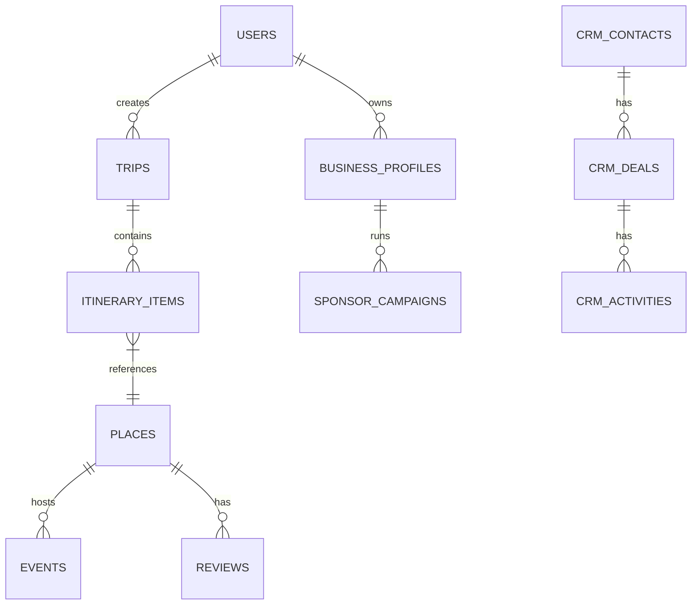
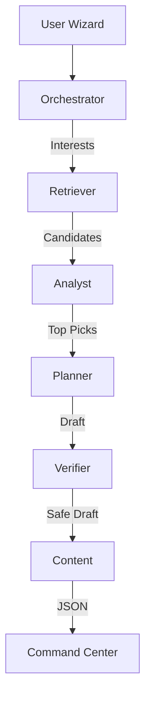
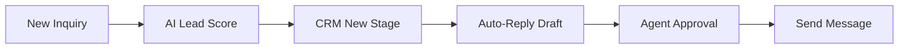

# Product Requirements Document (PRD): I Love Medellín

**Version:** 1.0  
**Status:** Approved for Development  
**Author:** Principal Product Architect  
**Date:** October 26, 2023

---

## Table of Contents

1.  [Executive Summary](#1-executive-summary)
2.  [Vision & Principles](#2-vision--principles)
3.  [Target Users & Personas](#3-target-users--personas)
4.  [Core Problems & Jobs-To-Be-Done](#4-core-problems--jobs-to-be-done)
5.  [Value Proposition & Benefits](#5-value-proposition--benefits)
6.  [Product Scope (Modules)](#6-product-scope-modules)
7.  [User Journeys](#7-user-journeys)
8.  [Information Architecture & Sitemap](#8-information-architecture--sitemap)
9.  [Screen-by-Screen Requirements](#9-screen-by-screen-requirements)
10. [Multi-Step Wizards](#10-multi-step-wizards)
11. [AI System Architecture](#11-ai-system-architecture)
12. [Gemini 3 Implementation Plan](#12-gemini-3-implementation-plan)
13. [Data Model (Supabase)](#13-data-model-supabase)
14. [Edge Functions & APIs](#14-edge-functions--apis)
15. [Automations](#15-automations)
16. [CRM + Project Management + Communications](#16-crm--project-management--communications)
17. [Payments, Monetization, Sponsors](#17-payments-monetization-sponsors)
18. [Analytics & Measurement](#18-analytics--measurement)
19. [Security, Compliance, Abuse Prevention](#19-security-compliance-abuse-prevention)
20. [Performance & Reliability](#20-performance--reliability)
21. [Rollout Phases](#21-rollout-phases)
22. [Risks & Mitigations](#22-risks--mitigations)
23. [Appendices (Diagrams)](#23-appendices-diagrams)

---

## 1. Executive Summary

**I Love Medellín** is a unified AI-powered platform serving two distinct ecosystems: **Travelers** seeking curated, personalized experiences in Medellín, and **Local Operators** (businesses) needing tools to manage inventory, leads, and customers.

It combines a **Trip Command Center** for planning with a **Vertical Marketplace** (Food, Events, Real Estate) and a **Business CRM**. The core differentiator is the **Human-in-the-Loop AI**, where agents proactively plan, optimize, and assist, but humans retain final control.

---

## 2. Vision & Principles

*   **AI as Co-Pilot, Not Autopilot:** AI proposes drafts and optimizations; the user acts as the "Controller" to approve or edit. AI never auto-books money without confirmation.
*   **Context is King:** The 3-panel layout ensures users always have context (Left), a workspace (Center), and intelligence/details (Right) simultaneously.
*   **Hyper-Local Authenticity:** The platform prioritizes local gems and accurate, ground-truth data over generic tourist traps.
*   **Seamless Transition:** Moving from "Dreaming" (Explore) to "Planning" (Trips) to "Booking" (Marketplace) to "Living" (Real Estate) happens in one unified interface.

---

## 3. Target Users & Personas

### Travelers
1.  **The First-Timer:** Needs safety assurance, classic itineraries (Comuna 13, Guatapé), and logistics help.
2.  **The Digital Nomad:** Needs Wi-Fi speed data, coworking communities, mid-term rentals, and networking events.
3.  **The Luxury Couple:** Needs high-end dining reservations, private transport, and concierge support.
4.  **The Family Planner:** Needs kid-friendly activities, safety logistics, and strict timing/pacing.

### Business Operators
5.  **Local Event Organizer:** Needs ticketing, attendee management, and promotional tools.
6.  **Restaurant Owner:** Needs table reservations, menu management, and review aggregation.
7.  **Rental Operator:** Needs inventory management (cars/scooters) and booking calendar.
8.  **Real Estate Agent:** Needs lead qualification for investment tours and property showcases.

### Internal
9.  **Sponsor/Brand:** Needs visibility metrics and automated reporting.
10. **Admin/Ops:** Needs moderation tools and system health monitoring.

---

## 4. Core Problems & Jobs-To-Be-Done

| User | Problem | Job-To-Be-Done |
| :--- | :--- | :--- |
| **Traveler** | "I'm overwhelmed by blogs and fragmented info." | **Plan my trip** in minutes with a trustworthy, day-by-day itinerary. |
| **Traveler** | "I don't know if this area is safe or logisticlly sensible." | **Optimize my route** to save time and keep me safe. |
| **Business** | "My leads are scattered across WhatsApp and email." | **Centralize my leads** into one CRM pipeline to close more deals. |
| **Business** | "I spend hours answering the same questions." | **Automate responses** using AI to save time while maintaining personal touch. |

---

## 5. Value Proposition & Benefits

| Feature Area | Core Value (Manual/Standard) | Advanced Value (AI-Powered) |
| :--- | :--- | :--- |
| **Trip Planning** | Drag-and-drop itinerary builder. | Generative itineraries based on complex constraints (budget + pace + interests). |
| **Discovery** | Searchable directory of places. | "Why this fits you" personalized explanations and semantic search. |
| **Logistics** | Map view of locations. | Route optimization (TSP solver) and real-time conflict detection (closed hours). |
| **CRM** | Contact database. | Lead scoring, sentiment analysis, and auto-drafted follow-ups. |
| **Real Estate** | Property listings. | Investment tour scheduling and ROI calculators based on market data. |

---

## 6. Product Scope (Modules)

1.  **Travel Discovery (Explore):** Feed of places, AI-curated collections.
2.  **Trips (Command Center):** Itinerary builder, budget tracker, booking manager.
3.  **Tourism:** Tours, landmarks, cultural experiences.
4.  **Events:** Concerts, networking, ticketing.
5.  **Restaurants:** Dining guide, reservations.
6.  **Rentals:** Transportation and gear bookings.
7.  **Real Estate:** Short/long-term stays, investment tours.
8.  **Saved:** Collections, user guides.
9.  **Concierge:** Multi-session AI chat.
10. **CRM:** Contacts, pipelines, deals.
11. **Project Management:** Tasks, roadmaps.
12. **Communications:** Unified Inbox (WhatsApp/Email).
13. **Payments:** Stripe integration.
14. **Analytics:** User and business dashboards.
15. **Sponsors:** Ad placements and reporting.

---

## 7. User Journeys

### A. Traveler: The "Perfect Weekend" Flow
1.  **Discover:** User browses "Explore" and saves 5 restaurants and 2 tours.
2.  **Plan:** User opens "Trip Wizard," inputs dates and budget.
3.  **Generate:** AI creates a draft itinerary integrating saved items + smart suggestions.
4.  **Refine:** User drags a dinner to Day 2; AI suggests a nearby bar for after-drinks.
5.  **Book:** User clicks "Book" on the tour; adds flight details manually via parser.
6.  **Experience:** During trip, "Concierge" suggests lunch based on current location.

### B. Business: The "Lead to Deal" Flow
1.  **Capture:** Real Estate Agent receives a "Book Investment Tour" inquiry.
2.  **Qualify:** AI scores lead (High Intent) based on budget input.
3.  **Engage:** System drafts a WhatsApp welcome message; Agent approves and sends.
4.  **Manage:** Agent moves lead to "Tour Scheduled" in CRM pipeline.
5.  **Close:** Tour happens; Agent marks "Won"; System sends automated feedback request.

---

## 8. Information Architecture & Sitemap

### 3-Panel Layout Logic
*   **Desktop:** 3 Columns (Nav/Context [20%] | Main Workspace [50%] | Intelligence/Details [30%]).
*   **Tablet:** 2 Columns (Nav + Main). Right panel slides over as an overlay/drawer.
*   **Mobile:** 1 Column (Main). Nav is bottom bar/drawer. Right panel is a bottom sheet.

### Routes
*   `/app/explore` (Main Feed)
*   `/app/trips` (List) -> `/app/trips/:id` (Command Center)
*   `/app/events` -> `/app/events/:id` (Detail Panel)
*   `/app/restaurants` -> `/app/restaurants/:id` (Detail Panel)
*   `/app/real-estate` -> `/app/real-estate/:id` (Detail Panel)
*   `/app/concierge` (Chat)
*   `/app/saved` (Library)
*   `/app/crm` (Dashboard) -> `/app/crm/contacts`, `/app/crm/deals`
*   `/app/pm` (Projects) -> `/app/pm/tasks`
*   `/app/comms` (Inbox)
*   `/app/settings`

---

## 9. Screen-by-Screen Requirements

### 1. Trip Command Center (`/app/trips/:id`)
*   **Left:** Trip metadata (dates, travelers), Budget progress bar, Module quick-add buttons.
*   **Main:** Timeline view (Day cards), Map view toggle.
*   **Right:**
    *   *Default:* "AI Actions" menu (Optimize, Check Weather, Suggest Nightlife).
    *   *Selection:* Item details, "Why this fits," Edit/Move buttons.
*   **Core:** Drag-and-drop, Add note, Add manual booking.
*   **Advanced:** "Regenerate Day" (AI), Conflict alerts (overlapping times).

### 2. CRM Dashboard (`/app/crm`)
*   **Left:** Pipelines selector, Filters (My leads, Unread).
*   **Main:** Kanban board (Stages) or List view.
*   **Right:** Contact detail + Activity Timeline + Quick Actions (WhatsApp/Email).
*   **Core:** Move cards, Add task, Log note.
*   **Advanced:** AI Lead Score, "Draft Reply" (Generative text).

### 3. Explore Feed (`/app/explore`)
*   **Left:** Categories, Filters (Price, Vibe).
*   **Main:** Infinite scroll cards, "AI Picks" carousel.
*   **Right:** Place details (Map, Hours, Reviews).
*   **Advanced:** "Search Grounding" results (Live events this week).

---

## 10. Multi-Step Wizards

### A. Trip Wizard
*   **Step 1 (Basics):** Dates, Travelers.
*   **Step 2 (Vibe):** Multi-select tags (Nightlife, Nature). *AI uses these for scoring.*
*   **Step 3 (Pace):** Chill vs. Packed. *AI uses this for density.*
*   **Step 4 (Budget):** Slider. *AI filters price levels.*
*   **Step 5 (Constraints):** Diet, Mobility. *AI applies hard filters.*
*   **Output:** Creates `Trip` record + triggers `generate_itinerary`.

### B. Business Onboarding
*   **Step 1:** Category & Basic Info.
*   **Step 2:** Media Upload (Images processed by Vision API for tags).
*   **Step 3:** Inventory/Menu setup.
*   **Step 4:** Stripe Connect onboarding.
*   **Output:** `BusinessProfile` + `InventoryItems`.

---

## 11. AI System Architecture

### Agent Types
1.  **Orchestrator (Manager):** Routes requests. Decides if a query needs DB search or Planner.
2.  **Planner (Scheduler):** Solves logic puzzles (Time x Distance). Used for itinerary generation.
3.  **Retriever (RAG):** Fetches context from Supabase Vector Store (Places, Rules).
4.  **Analyst (Scorer):** Evaluates items against user profiles. Returns a match score (0-1).
5.  **Verifier (Safety):** Checks hard constraints (Opening hours, Safety zones).
6.  **Content/Comms:** Drafts friendly UI text, WhatsApp replies, and descriptions.
7.  **Controller:** The human-in-the-loop gate. All "Write" actions to critical data require approval.

### Workflow Example: Itinerary Generation
1.  **User** submits Wizard.
2.  **Orchestrator** calls **Retriever** to get 50 candidates based on interests.
3.  **Analyst** scores candidates; returns Top 20.
4.  **Planner** groups Top 20 into days/clusters based on location.
5.  **Verifier** checks opening hours for specific dates.
6.  **Content** generates "Why this fits" text.
7.  **Output:** JSON draft sent to frontend.

---

## 12. Gemini 3 Implementation Plan

| Feature | Model | Tool / Capability | Usage |
| :--- | :--- | :--- | :--- |
| **Itinerary Generation** | `gemini-3-pro-preview` | **Thinking**, **Structured Output** | Deep reasoning to balance budget, pace, and interests. Output matches `ItinerarySchema`. |
| **Route Optimization** | `gemini-3-pro-preview` | **Code Execution** (Optional), **Thinking** | Solves Traveling Salesman Problem logic for day clusters. |
| **Live Event Search** | `gemini-3-pro-preview` | **Google Search Grounding** | "Concerts in Medellín this weekend" to fill itinerary gaps. |
| **Place Details** | `gemini-3-flash-preview` | **Google Maps Grounding** | Get real-time hours, reviews snippet, and travel times. |
| **Concierge Chat** | `gemini-3-flash-preview` | **Interactions API** | Fast, conversational responses with memory. |
| **CRM Lead Scoring** | `gemini-3-flash-preview` | **Structured Output** | Analyze inquiry text -> Return Score (1-100) + Sentiment. |
| **Booking Parsing** | `gemini-3-flash-preview` | **Extractor** | Paste email text -> Extract Flight/Hotel JSON. |
| **Menu/Flyer Scan** | `gemini-3-pro-preview` | **Vision** | Upload image of menu -> Extract items/prices to DB. |

---

## 13. Data Model (Supabase)

### Core Schema (ERD Logic)

### Key Tables
*   `trips`: `id`, `user_id`, `preferences` (JSONB), `status`.
*   `itinerary_items`: `trip_id`, `place_id`, `start_time`, `end_time`, `ai_reason`, `is_locked`.
*   `places`: `id`, `name`, `location` (PostGIS), `embedding` (Vector), `metadata`.
*   `crm_contacts`: `id`, `business_id`, `name`, `whatsapp`, `stage`.
*   `crm_messages`: `id`, `contact_id`, `direction`, `channel` (WhatsApp/Email), `content`.

---

## 14. Edge Functions & APIs

*   `generate_itinerary`: Input `trip_profile`. Output `ItineraryJSON`.
*   `optimize_route`: Input `day_items`. Output `SortedItems`.
*   `check_conflicts`: Input `itinerary`. Output `ConflictArray`.
*   `recommend_places`: Input `user_vector`. Output `PlaceArray`.
*   `crm_lead_score`: Input `message_text`. Output `ScoreJSON`.
*   `send_whatsapp`: Input `template_id, params`. Calls Provider API.
*   `extract_booking`: Input `raw_text`. Output `BookingJSON`.

---

## 15. Automations

1.  **Inventory Alert:** If `tickets_remaining < 5`, trigger `send_whatsapp` to Admin.
2.  **Stale Lead:** If `crm_deal` in stage "New" > 24h, create `crm_task` "Follow up".
3.  **Trip Conflict:** If `flight_time` changes, trigger `check_conflicts` for Trip.

---

## 16. CRM + Project Management + Communications

*   **Unified Inbox:** A single view aggregating WhatsApp (via Twilio/Meta API) and Email (via Resend/SendGrid).
*   **Pipelines:** Customizable stages (e.g., "New Inquiry", "Tour Scheduled", "Negotiation", "Closed").
*   **Projects:** Task lists attached to Deals or Operations.
*   **Templates:** AI-generated/Human-edited snippets for rapid reply.

---

## 17. Payments, Monetization, Sponsors

### Revenue Model
1.  **Traveler Premium ($5/mo):** Offline maps, Unlimited AI regens, Concierge priority.
2.  **Business Pro ($30/mo):** CRM access, Analytics, 500 WhatsApp msgs/mo.
3.  **Marketplace Fees:** 5-10% on booked tours/rentals.
4.  **Sponsors:** "Featured" placement in Explore/Trip Wizard.

### Integration
*   **Stripe Connect:** For splitting payments between Platform and Vendors.
*   **Billing Portal:** For managing subscriptions.

---

## 18. Analytics & Measurement

*   **Acquisition:** App Downloads, Signups.
*   **Activation:** "First Trip Generated", "First Booking".
*   **Retention:** Trips created per month, Concierge queries.
*   **Monetization:** GMV, MRR, CAC.
*   **Instrumentation:** Track `ai_generation_request`, `itinerary_item_add`, `crm_deal_move`.

---

## 19. Security, Compliance, Abuse Prevention

*   **RLS (Row Level Security):** Strict ownership rules. Users see only their trips. Businesses see only their leads.
*   **Abuse:** Rate limit AI generation (5 per hour free tier).
*   **Data:** Encrypt PII. GDPR/CCPA compliance for data deletion.

---

## 20. Performance & Reliability

*   **Edge Caching:** Cache public place data (CDN).
*   **Optimistic UI:** Show itinerary moves immediately, rollback on failure.
*   **Vector Search:** Index `places` embedding for <100ms retrieval.

---

## 21. Rollout Phases

*   **Phase 1 (Skeleton):** UI Shell, Database Schema, Explore Feed (Read-only).
*   **Phase 2 (Brain):** Trip Wizard, Basic Itinerary Gen (Mocked Retrieval), Auth.
*   **Phase 3 (Intelligence):** Live RAG, Google Grounding, Concierge, Basic CRM.
*   **Phase 4 (Marketplace):** Bookings, Payments, Full CRM, Real Estate.
*   **Phase 5 (Scale):** Sponsors, Premium Subscriptions, Optimization.

---

## 22. Risks & Mitigations

*   **Risk:** AI Hallucinations (suggesting closed places).
    *   *Mitigation:* Verifier Agent checks DB/Google Maps data before displaying.
*   **Risk:** API Costs (Gemini/Google Maps).
    *   *Mitigation:* Caching, Rate limiting, "Flash" models for high-volume tasks.
*   **Risk:** Empty Marketplace (Chicken & Egg).
    *   *Mitigation:* Seed DB with scraped/public data (labeled "Unclaimed") to provide traveler value first.

---

## 23. Appendices (Diagrams)

### A. AI Itinerary Workflow

### B. CRM Lead Flow

