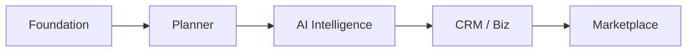
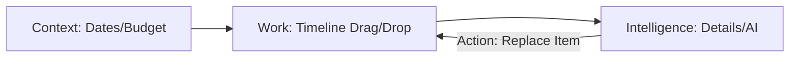
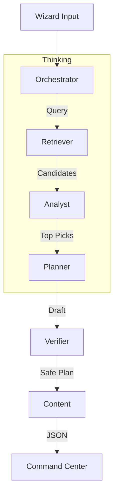

# Roadmap: I Love Medellín - AI Travel & City Discovery Platform

**Version:** 1.0  
**Based on:** Product Requirements Document v1.0  
**Target:** Production Release

---

## 1. Executive Roadmap Summary

**Strategy:**  
The build strategy follows a **"Catalog First, Intelligence Second, Transaction Third"** approach. We initially build a robust, read-heavy discovery platform ("The Catalog") to establish user trust and SEO value. Once the data foundation is set, we layer on the **AI Planning Engine** (Gemini 3) to transform static places into dynamic itineraries. Finally, we unlock the **Marketplace & CRM** layers to monetize the traffic generated by the free planning tools.

**North Star:**  
A unified "Operating System for Medellín" where a user can go from a vague idea ("I want a fun weekend") to a fully booked, logistically optimized itinerary without leaving the interface, while local businesses manage those leads seamlessly in the same ecosystem.

---

## 2. Phased Roadmap (High Level)

| Phase | Name | Focus | Key Value Unlocked |
| :--- | :--- | :--- | :--- |
| **1** | **Foundation & Discovery** | Frontend Shell, Catalog, UI UX | Users can browse curated places in a high-quality 3-panel interface. |
| **2** | **The Core Planner** | Auth, Trip Wizard, Itinerary Builder | Users can save places and manually build/edit day-by-day trips. |
| **3** | **AI Intelligence** | Gemini 3 Agents, RAG, Optimization | The "Magic Moment" where AI generates complete trips and optimizes routes. |
| **4** | **Business & CRM** | B2B Portal, Leads, Pipelines | Businesses can claim profiles and manage leads generated by travelers. |
| **5** | **Marketplace & Scale** | Bookings, Payments, Analytics | End-to-end transactions and monetization via Stripe Connect. |

---

## 3. Phase-by-Phase Breakdown

### Phase 1: Foundation & Discovery (The Read-Only MVP)

#### 3.1 Purpose & Outcomes
*   **Goal:** Ship a pixel-perfect, responsive app shell with the signature 3-panel layout.
*   **User Value:** Travelers can discover high-quality, curated places (Restaurants, Events, Tourist spots) and view rich details.
*   **System Value:** Establishes the component library, routing architecture, and "Places" database.

#### 3.2 Screens & Routes
| Route | Screen Name | Role |
| :--- | :--- | :--- |
| `/` | Landing Page | Marketing & Conversion |
| `/app/explore` | Explore Feed | Main discovery catalog (Restaurants, Stays, Activities) |
| `/app/tourist` | Tourist Hub | Curated list of major landmarks (Comuna 13, etc.) |
| `/app/events` | Events Feed | Temporal listings (Concerts, Festivals) |

#### 3.3 UI/UX Rules (3-Panel Logic)
*   **Desktop (XL):**
    *   **Left (20%):** Navigation Sidebar (Context).
    *   **Main (50%):** Infinite Scroll Feed (Work).
    *   **Right (30%):** Static Details Panel (Intelligence/Map).
*   **Tablet (MD/LG):**
    *   **Right Panel:** Becomes a slide-over drawer triggered by clicking a card.
*   **Mobile (SM):**
    *   **Left:** Collapsed into bottom nav.
    *   **Right:** Becomes a bottom sheet modal.

---

### Phase 2: The Core Planner (Manual Planning)

#### 3.1 Purpose & Outcomes
*   **Goal:** Enable "Write" capabilities. Users can create accounts, save items, and build trips manually.
*   **User Value:** "I can organize my research into a real plan."
*   **System Value:** Implements Auth (Supabase), `Trips` schema, and the Drag-and-Drop timeline UI.

#### 3.2 Screens & Routes
| Route | Screen Name | Role |
| :--- | :--- | :--- |
| `/app/trips` | My Trips List | Dashboard of user's plans |
| `/app/trips/:id` | **Command Center** | The core planning interface (Timeline + Map) |
| `/app/saved` | Saved Places | Personal collection/bookmarks |

#### 3.3 UI/UX Rules (Command Center)
*   **Left:** Trip Metadata (Dates, Travelers, Budget Status).
*   **Main:** Vertical Timeline (Day 1, Day 2...). Drag-and-drop slots.
*   **Right:**
    *   *Default:* "Bucket List" (Saved items not yet scheduled).
    *   *On Selection:* Item Details + "Move to Day X" actions.

---

### Phase 3: AI Intelligence (The Agent Layer)

#### 3.1 Purpose & Outcomes
*   **Goal:** Connect the Gemini 3 Brain. Transform the Wizard into a generator.
*   **User Value:** "The app plans for me." (Time-to-plan drops from hours to seconds).
*   **System Value:** Deploys Edge Functions, Vector Search (RAG), and Google Grounding.

#### 3.2 Features
*   **Trip Wizard:** Now triggers `generate_itinerary` Edge Function.
*   **Optimize Route:** Button in Command Center reorders a day's items for efficiency.
*   **Concierge Chat:** Live conversational agent in `/app/concierge`.

#### 3.3 UI/UX Rules (AI Feedback)
*   **Streaming UI:** Wizards show "Thinking..." steps (e.g., "Scanning Restaurants...", "Checking Weather...").
*   **Right Panel:** Now shows "AI Rationale" (Why this place was chosen) when an auto-generated item is selected.

---

### Phase 4: Business & CRM (B2B Layer)

#### 3.1 Purpose & Outcomes
*   **Goal:** Allow local operators to manage their presence and leads.
*   **User Value (Biz):** "I can stop using messy WhatsApp chats and manage leads in one place."
*   **System Value:** `BusinessProfiles`, `Leads`, `CRM` schema.

#### 3.2 Screens & Routes
| Route | Screen Name | Role |
| :--- | :--- | :--- |
| `/app/crm` | CRM Dashboard | Kanban board of leads |
| `/app/comms` | Unified Inbox | WhatsApp/Email aggregator |
| `/app/business` | Profile Manager | Edit menu, photos, hours |

#### 3.3 UI/UX Rules (CRM)
*   **Left:** Pipeline Stages selector.
*   **Main:** List/Board of Leads.
*   **Right:** Contact Detail + AI Drafted Reply + Activity Log.

---

## 4. Wizards, Chatbots & Dashboards

| Phase | Component | Type | Inputs | AI Agents | Output |
| :--- | :--- | :--- | :--- | :--- | :--- |
| **2** | **Trip Wizard** | Modal (5-Step) | Dates, Vibe, Pace, Budget | *None (Manual)* | Empty Trip Shell |
| **3** | **Trip Wizard (AI)** | Modal (5-Step) | Dates, Vibe, Pace, Budget | Orchestrator, Planner, Retriever | **Full JSON Itinerary** |
| **3** | **Concierge** | Chat Interface | Natural Language | Retriever, Google Search | Text Answer + UI Cards |
| **4** | **Biz Onboarding** | Wizard | Category, Name, Photos | Vision (Menu Scan) | Business Profile |
| **4** | **Lead Assistant** | Chat (Internal) | Lead Inquiry Text | Analyst (Scorer) | Sentiment + Draft Reply |

---

## 5. User Journeys (Real-World)

### Journey A: The "Weekend Warrior" (Traveler)
1.  **Trigger:** User lands on `/app/explore` looking for "Nightlife".
2.  **Plan:** Clicks "Plan Trip" -> Wizard -> Selects "Party", "Oct 12-14", "Budget: Comfort".
3.  **AI Action (Phase 3):** System generates a 3-day plan.
    *   *Day 1 PM:* Dinner at Oci.Mde -> Drinks at Envy Rooftop.
    *   *Day 2 AM:* Recovery Brunch at Pergamino.
4.  **Refine:** User drags Brunch to 11 AM.
5.  **Output:** Saves Trip.

### Journey B: The "Investment Tour" (Business)
1.  **Trigger:** Traveler requests "Real Estate Tour" on a listing.
2.  **CRM:** Agent sees new lead in `/app/crm`.
3.  **AI Action (Phase 4):**
    *   System scores lead: "High Value (Budget > $300k)".
    *   System drafts WhatsApp: "Hola! saw you're interested in Poblado. Available Tuesday?"
4.  **Action:** Agent clicks "Send". Lead moves to "Contacted".

---

## 6. AI Agent Architecture (Phase 3+)

| Agent | Role | Model | Trigger | Output |
| :--- | :--- | :--- | :--- | :--- |
| **Orchestrator** | Manager | `gemini-3-pro-preview` | Wizard Submit | Delegated Tasks / Final JSON |
| **Retriever** | Fetcher | `gemini-3-flash-preview` | Orchestrator Call | List of Candidates (from DB) |
| **Planner** | Scheduler | `gemini-3-pro-preview` | List of Candidates | Ordered Itinerary (Time x Dist) |
| **Verifier** | Safety | `gemini-3-flash-preview` | Draft Schedule | Conflict Flags (Closed Hours) |
| **Explainer** | Copywriter | `gemini-3-flash-preview` | Item Selection | "Why this fits you" Text |
| **Analyst** | Scorer | `gemini-3-flash-preview` | New CRM Lead | Lead Score (1-100) |

---

## 7. Gemini 3 Feature Mapping

| Screen / Feature | Model | Feature Used | Capability |
| :--- | :--- | :--- | :--- |
| **Trip Wizard** | `gemini-3-pro-preview` | **Structured Outputs** | Generate strict JSON `Itinerary` object. |
| **Optimize Route** | `gemini-3-pro-preview` | **Thinking** | Solve TSP (Traveling Salesman) logic. |
| **Events Feed** | `gemini-3-pro-preview` | **Google Search Grounding** | "Concerts in Medellín this week" |
| **Place Details** | `gemini-3-flash-preview` | **Google Maps Grounding** | Real-time reviews/hours. |
| **Concierge** | `gemini-3-flash-preview` | **Interactions API** | Chat context retention. |
| **CRM Lead** | `gemini-3-flash-preview` | **Structured Outputs** | Extract intent/budget from unstructured text. |
| **Biz Onboarding** | `gemini-3-pro-preview` | **Vision** | Extract menu items from photos. |

---

## 8. Data & Backend Plan

### 8.1 Supabase Schema
*   **Phase 1:** `places` (id, name, location, metadata), `events`.
*   **Phase 2:** `users`, `trips`, `itinerary_items`, `saved_places`.
*   **Phase 4:** `business_profiles`, `crm_contacts`, `crm_deals`, `crm_messages`.
*   **Phase 5:** `bookings`, `payments`.

### 8.2 Edge Functions
| Function | Phase | Input | Output | Trigger |
| :--- | :--- | :--- | :--- | :--- |
| `generate_itinerary` | 3 | `TripPreferences` | `ItineraryJSON` | Wizard Submit |
| `optimize_route` | 3 | `DayItems[]` | `SortedItems[]` | "Optimize" Button |
| `chat_concierge` | 3 | `MessageHistory` | `ResponseText` | Chat Input |
| `score_lead` | 4 | `LeadText` | `ScoreJSON` | New CRM Entry |

---

## 9. Frontend ↔ Backend Wiring

*   **Explore:** Fetches `places` via Supabase JS Client (Cached).
*   **Trip Command Center:**
    *   Reads `trips` via Supabase Subscription (Realtime).
    *   Writes moves via optimistic UI updates -> Supabase.
*   **AI Actions:**
    *   Frontend calls Edge Function (`functions.invoke('generate_itinerary')`).
    *   Shows loading skeleton.
    *   Receives JSON -> Updates Local State -> Saves to DB.

---

## 10. Automations & Workflows

*   **Conflict Check (Phase 3):**
    *   *Trigger:* User moves an item in Timeline.
    *   *Logic:* Check if `new_time` is within `place.opening_hours`.
    *   *Alert:* Show red warning toast if closed.
*   **Lead Stagnation (Phase 4):**
    *   *Trigger:* Cron job (Midnight).
    *   *Logic:* If Deal in "New" > 24h.
    *   *Action:* Create Task for Agent.

---

## 11. Diagrams

### A. Phase Progression

### B. 3-Panel Interaction (Trip Command Center)

### C. AI Agent Flow (Itinerary Gen)

---

## 12. Production-Ready Checklist

### UX & Design
- [ ] 3-Panel layout behaves correctly on all breakpoints.
- [ ] Drag-and-drop on Timeline is smooth (no jank).
- [ ] Loading states (skeletons) for all AI operations.

### Data & AI
- [ ] Supabase RLS policies prevent data leaks between users.
- [ ] Gemini API keys stored securely in Edge Environment (NOT Client).
- [ ] Fallback logic: If AI fails, show "Manual Mode".
- [ ] Rate limiting implemented (e.g., 5 gens/hour).

### Performance
- [ ] `places` data is cached or statically generated where possible.
- [ ] Image assets optimized (WebP).
- [ ] Bundle size monitored (<500kb initial load).

### Compliance
- [ ] Terms of Service updated for AI usage.
- [ ] "AI-Generated" labels visible on all auto-content.
