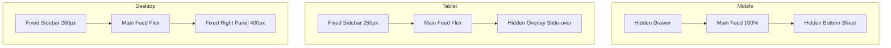

# Task 01: Project Foundation & Layout Engine

**Phase:** 1 - Foundation & Discovery  
**Role:** Frontend Engineer / Design Systems  

## 1. Purpose
Establish the technical bedrock of the application, specifically the responsive **3-Panel Layout Engine** which is the core UX pattern for the entire platform.

## 2. Goals
- [ ] Initialize Vite + React + TS project with strict linting.
- [ ] Implement robust Routing architecture (HashRouter).
- [ ] Build the responsive `Layout.tsx` that handles the 3-panel logic (Sidebar, Main, Detail).
- [ ] Setup Tailwind theme with `medellin` (green) and `brand` (orange) palettes.

## 3. 3-Panel UI Requirements (CRITICAL)

**Logic:**
- **Left Panel (Context):** Navigation, Filters, Metadata.
- **Center Panel (Work):** Feeds, Lists, Canvases, Maps.
- **Right Panel (Intelligence):** Details, AI Insights, Chat.

**Responsive Behavior:**
| Breakpoint | Layout | Behavior |
| :--- | :--- | :--- |
| **Mobile (<768px)** | 1 Column | Left = Drawer (Hamburger). Right = Bottom Sheet. Main = Full Width. |
| **Tablet (768px-1280px)** | 2 Columns | Left = Fixed Sidebar. Main = Fluid. Right = Slide-over Overlay (z-index 50). |
| **Desktop (>1280px)** | 3 Columns | Left = Fixed. Main = Fluid. Right = Fixed/Static (Part of flow). |

## 4. Frontend Requirements

### Architecture
- **Router:** `react-router-dom` v6+ (Data Router preferred, but HashRouter accepted for static constraints).
- **State:** React Context for `LayoutState` (`isSidebarOpen`, `isRightPanelOpen`, `activeRightPanelMode`).

### Components
- `AppShell`: The wrapper component handling the breakpoints.
- `Sidebar`: Collapsible, distinct mobile/desktop modes.
- `RightPanelContainer`: A polymorphic container that renders as a static div (Desktop), Drawer (Tablet), or BottomSheet (Mobile).

## 5. Screens & Routes
| Route | Component | Left | Main | Right |
| :--- | :--- | :--- | :--- | :--- |
| `/app` | Layout | Nav | `<Outlet />` | Contextual |

## 6. Acceptance Criteria
- [ ] `npm run dev` starts without errors.
- [ ] Resizing window from Mobile -> Tablet -> Desktop seamlessly adapts the layout.
- [ ] Clicking a nav item on Mobile closes the drawer.
- [ ] Right panel can be toggled via URL query param or internal state.
- [ ] Tailwind colors `bg-medellin-500` works.

## 7. Diagrams

### 3-Panel Responsiveness

